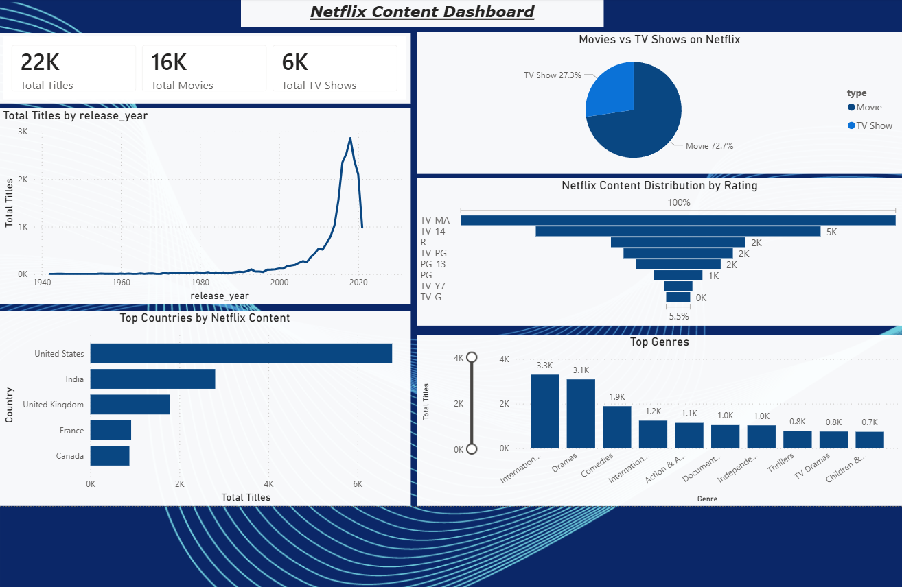

# Netflix Content Dashboard (Power BI)

## 📊 Project Overview
This project presents an interactive Power BI dashboard created to analyze Netflix’s content library. The dashboard provides insights into content growth, genre distribution, country-wise contribution, ratings, and the overall mix of movies and TV shows.

## 🔧 Tools Used
- Power BI
- Power Query
- DAX
- CSV Dataset

## 📁 Dataset
- Netflix Movies and TV Shows dataset
- Source: Publicly available Netflix dataset

## 📈 Key Insights
- Netflix’s catalog is movie-heavy (~73% movies).
- Significant growth in content after 2015.
- International Movies and Dramas dominate the platform.
- The United States and India are top content contributors.
- Most content targets teenage and adult audiences.

## 🖼 Dashboard Preview

## 📌 Business Questions Answered
- How has Netflix content grown over time?
- Which genres dominate the platform?
- Which countries contribute the most content?
- What type of content does Netflix focus on?
- What audience is Netflix primarily targeting?

## 📂 Files in this Repository
- `Netflix_Content_Dashboard.pbix` – Power BI dashboard file
- `dataset/netflix_titles.csv` – Dataset used
- `screenshots/` – Dashboard images

## 👤 Author
Rahul Singh  
Aspiring Data Analyst
